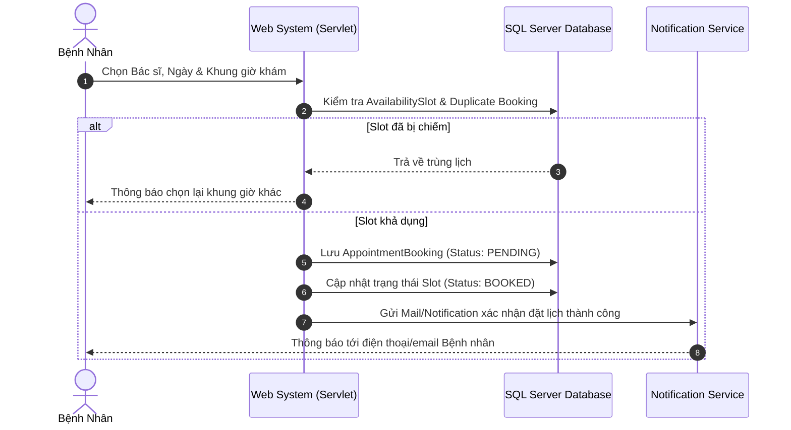
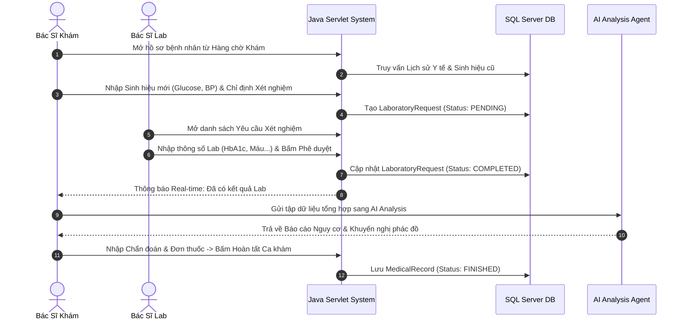
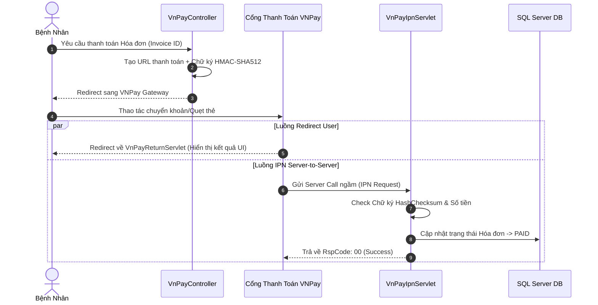
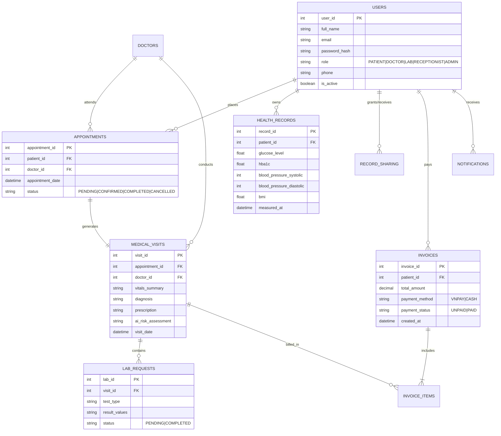

# TÀI LIỆU KIẾN TRÚC HỆ THỐNG VÀ ĐẶC TẢ NGHIỆP VỤ (SYSTEM ARCHITECTURE & BUSINESS SPECIFICATION)
## DỰ ÁN: HỆ THỐNG THEO DÕI & CẢNH BÁO SỚM TIỂU ĐƯỜNG (DIABETES MONITORING & EARLY WARNING SYSTEM)

---

## 1. TỔNG QUAN HỆ THỐNG (SYSTEM OVERVIEW & VISION)

### 1.1. Giới thiệu dự án
**Hệ thống Theo dõi & Cảnh báo Sớm Tiểu đường (Diabetes Monitoring & Early Warning System - SWP391)** là một giải pháp chuyển đổi số toàn diện cho công tác quản lý, khám chữa bệnh và theo dõi chỉ số sức khỏe của bệnh nhân tiểu đường. 

Hệ thống kết hợp giữa **Quản lý Y tế Lâm sàng (Clinical EMR & Clinic Management)** và **Trí tuệ nhân tạo (AI Analysis Agent)** nhằm:
1. Tự động hóa toàn bộ quy trình khám chữa bệnh tại phòng khám (từ tiếp đón, phân phòng, khám lâm sàng, chỉ định xét nghiệm đến thanh toán và kê đơn).
2. Cho phép bệnh nhân chủ động theo dõi các chỉ số sức khỏe sau khi khám (Glucose, HbA1c, Huyết áp, BMI, Cân nặng...).
3. Tích hợp AI thông minh để phân tích nguy cơ bệnh, đưa ra khuyến nghị tóm tắt cá nhân hóa thông tin và cảnh báo sớm các biến chứng nguy hiểm.
4. Hỗ trợ mô hình chia sẻ dữ liệu gia đình (Family Sharing), giúp người thân dễ dàng theo dõi chỉ số sức khỏe của người bệnh (đặc biệt là người cao tuổi).

### 1.2. Mục tiêu dành cho Business Analyst (BA)
Tài liệu này được biên soạn độc lập và đầy đủ nhằm giúp **Business Analyst (BA)**, **Solution Architect (SA)**, **Product Owner (PO)** và **Đội ngũ Lập trình viên** nắm bắt 100% cấu trúc hệ thống, quy trình nghiệp vụ (Business Workflows), ma trận phân quyền (Authorization Matrix), công nghệ sử dụng cũng như các ràng buộc phi chức năng.

---

## 2. PHÂN TÍCH ĐỐI TƯỢNG SỬ DỤNG & PHÂN QUYỀN (USER ROLES & AUTHORIZATION MATRIX)

### 2.1. Các Đối Tượng Sử Dụng Hệ Thống (User Roles)

Hệ thống bao gồm **6 nhóm người dùng chính**:

| STT | Đối Tượng (Role) | Mô Tả Vai Trò |
|---|---|---|
| 1 | **Bệnh Nhân (Patient)** | Người bệnh trực tiếp sử dụng hệ thống để theo dõi chỉ số sức khỏe, đặt lịch khám, thanh toán hóa đơn, tương tác với AI tư vấn và chia sẻ dữ liệu với người thân. |
| 2 | **Bác Sĩ Khám Bệnh (Doctor / Physician)** | Bác sĩ lâm sàng thực hiện khám bệnh, chẩn đoán, xem chỉ số lịch sử, chỉ định xét nghiệm cận lâm sàng, xem dự báo AI và đưa ra kết luận. |
| 3 | **Bác Sĩ Xét Nghiệm (Doctor Lab / Lab Technician)** | Kỹ thuật viên / Bác sĩ phòng xét nghiệm tiếp nhận yêu cầu, nhập kết quả xét nghiệm máu/đường huyết, phê duyệt và trả kết quả về hồ sơ bệnh án. |
| 4 | **Lễ Tân (Receptionist)** | Nhân viên tiếp đón thực hiện đăng ký bệnh nhân mới, phân bổ phòng khám/hàng chờ (Queue System), và thu phí tại quầy. |
| 5 | **Quản Trị Viên (Admin)** | Quản trị viên hệ thống quản lý tài khoản/phân quyền, danh mục dịch vụ & bảng giá, sơ đồ phòng khám, lịch làm việc bác sĩ, cấu hình AI và xem báo cáo thống kê. |
| 6 | **Người Thân Gia Đình (Family Caregiver)** | Người thân có tài khoản trên hệ thống với vai trò người dùng ( patient ) được bệnh nhân ủy quyền truy cập để xem tình trạng sức khỏe, đồng hành cùng bệnh nhân. |

---

### 2.2. Ma Trận Phân Quyền Dynamic (Role-Based Access Control Matrix)

| Phân Hệ / Chức Năng | Patient | Doctor | Doctor Lab | Receptionist | Admin | Family Caregiver |
|---|:---:|:---:|:---:|:---:|:---:|:---:|
| **Quản lý Tài Khoản & Profile** | C Cá nhân | V | - | C/U Bệnh nhân | CRUD Tất cả | C Cá nhân |
| **Nhập & Theo dõi Chỉ số Sức khỏe** | CRUD Cá nhân | CRUD Bệnh nhân | C/U Chỉ số Lab | - | V | V (Được chia sẻ) |
| **Đặt Lịch Khám (Appointment Booking)** | C/V Cá nhân | V Lịch trực | - | C/U/D Tất cả | V Tất cả | C (Hỗ trợ người thân) |
| **Điều Phối Phòng Khám & Hàng Chờ** | V Trạng thái | V Phòng mình | - | CRUD Hàng chờ | V Tất cả | - |
| **Khám Lâm Sàng & Kê Đơn** | V Bệnh án mình | CRUD Bệnh án | - | - | V | V (Được chia sẻ) |
| **Yêu Cầu & Cập Nhật Xét Nghiệm** | V Kết quả | C/V Yêu cầu | CRUD Kết quả Lab | - | V | V (Được chia sẻ) |
| **Tư Vấn AI (AI Chat & Health Risk)** | CRUD Chat | V Kết quả AI | - | - | Config AI Prompts | - |
| **Thanh Toán Hóa Đơn (VNPay / Cash)** | C/V (VNPay) | - | - | C/U (Tiền mặt/VNPay) | V Báo cáo | - |
| **Chia Sẻ Gia Đình (Family Sharing)** | CRUD Chia sẻ | - | - | - | - | V Dashboard dùng chung |
| **Báo Cáo & Thống Kê System** | - | - | - | - | CRUD Reports | - |

*Ghi chú: C: Create, R/V: Read/View, U: Update, D: Delete.*

---

## 3. YÊU CẦU CHỨC NĂNG CHI TIẾT THEO ROLE (DETAILED FUNCTIONAL REQUIREMENTS)

### 3.1. Phân Hệ Bệnh Nhân (Patient Agent & Features)

#### UC-PAT-01: Đăng ký & Xác thực Tài khoản
- **Mô tả**: Bệnh nhân đăng ký tài khoản qua Email. Hệ thống gửi mã OTP xác thực qua Email (Jakarta Mail) trước khi kích hoạt tài khoản.
- **Dữ liệu đầu vào**: Họ tên, Email, Mật khẩu, Số điện thoại, Ngày sinh, Giới tính.
- **Logic xử lý**:
  - Mã hóa mật khẩu bằng thuật toán **BCrypt**.
  - Tạo token xác thực email có thời hạn.
  - Gửi email xác thực tự động.
- **Đầu ra**: Tài khoản được kích hoạt thành công, tự động chuyển hướng đăng nhập.

#### UC-PAT-03: Đặt Lịch Khám Trực Tuyến (Online Appointment Booking)
- **Mô tả**: Cho phép bệnh nhân chọn Bác sĩ, Chuyên khoa, Ngày khám, Khung giờ khám (Time Slot) khả dụng và loại dịch vụ khám.
- **Logic xử lý**:
  - Truy vấn bảng `DoctorSchedule` & `AvailabilitySlot` để lọc thời gian rảnh của Bác sĩ.
  - Khóa slot đặt lịch (tránh việc 1 bệnh nhân đặt trùng 1 khung giờ nhiều lịch hẹn).
  - Gửi thông báo xác nhận đặt lịch (Notification Agent).

#### UC-PAT-04: Chat Tư Vấn Sức Khỏe AI (AI Diabetes Health Assistant)
- **Mô tả**: Bệnh nhân chat trực tiếp với AI Agent chuyên biệt về tiểu đường để được tư vấn dinh dưỡng, lối sống và giải đáp thắc mắc.
- **Logic xử lý**:
  - Kết nối với **Google Gemini API** qua REST API.
  - Đóng gói System Prompt với dữ liệu tiền sử bệnh và chỉ số mới nhất của bệnh nhân.
  - Trả về câu trả lời dạng Streaming/Real-time.
  - Lưu trữ lịch sử cuộc hội thoại (`ChatMessage`) và tự động tóm tắt cuộc gọi (`AISummaryServlet`).

#### UC-PAT-05: Thanh Toán Hóa Đơn Trực Tuyến Qua VNPay
- **Mô tả**: Bệnh nhân thanh toán chi phí khám, xét nghiệm trực tuyến thông qua Cổng thanh toán VNPay.
- **Logic xử lý**:
  - Khởi tạo giao dịch VNPay với Secure Hash HMAC-SHA512 (`VnPayController`).
  - Chuyển hướng bệnh nhân sang cổng VNPay.
  - Nhận Callback (`VnPayReturnServlet`) và Xử lý IPN ngầm (`VnPayIpnServlet`) để cập nhật trạng thái hóa đơn `PAID`.

#### UC-PAT-06: Chia Sẻ Dữ Liệu Gia Đình (Family Sharing & Group Dashboard)
- **Mô tả**: Bệnh nhân tạo mã chia sẻ hoặc gửi lời mời kết nối cho người thân trong gia đình.
- **Logic xử lý**:
  - Quản lý quyền truy cập trong bảng `RecordSharing` (Cho phép xem/Chỉ đọc).
  - Người thân có thể truy cập `FamilyDashboardServlet` để xem biểu đồ đường huyết của người bệnh.

---

### 3.2. Phân Hệ Bác Sĩ Khám Bệnh (Doctor Agent & Features)

#### UC-DOC-01: Quản lý Danh sách Bệnh nhân Khám (Examination Queue)
- **Mô tả**: Xem danh sách bệnh nhân đang chờ khám tại phòng của mình.
- **Dữ liệu hiển thị**: Mã bệnh nhân, Họ tên, Tuổi, Thời gian hẹn, Trạng thái (Đang chờ, Đang khám, Hoàn thành).

#### UC-DOC-02: Nhập Chỉ số Sinh hiệu & Ghi chú Lâm sàng (Save Vitals & Notes)
- **Mô tả**: Bác sĩ đo và cập nhật các chỉ số sinh hiệu trực tiếp trong ca khám (`SaveVitalsServlet`) và nhập ghi chú bệnh lý (`SaveNotesServlet`).

#### UC-DOC-03: Chỉ định Xét nghiệm Cận Lâm sàng (Laboratory Request)
- **Mô tả**: Bác sĩ chọn các dịch vụ xét nghiệm (Đường huyết lúc đói, HbA1c, Sinh hóa máu, Điện tâm đồ...) cho bệnh nhân.
- **Logic xử lý**:
  - Tạo phiếu `LaboratoryRequest` với trạng thái `PENDING`.
  - Tự động đẩy phiếu xét nghiệm sang Phân hệ Bác sĩ Xét nghiệm (Doctor Lab).

#### UC-DOC-04: Gọi AI Phân Tích Nguy Cơ Tiểu Đường (Process AI Analysis)
- **Mô tả**: Bác sĩ kích hoạt AI Analysis Agent (`ProcessAIServlet`) để dự đoán nguy cơ tiến triển tiểu đường dựa trên tập chỉ số tổng hợp của bệnh nhân.
- **Đầu ra AI**: % Tỷ lệ nguy cơ, các yếu tố rủi ro chính và gợi ý phác đồ điều trị hỗ trợ bác sĩ.

// Tôi đã bỏ tính năng chuyển ca và kê đơn thuốc //

#### UC-DOC-06: Hoàn Tất Ca Khám (Complete Visit)
- **Mô tả**: Bác sĩ nhập lời dặn, kết luận và bấm hoàn tất ca khám (`CompletedRecordsServlet`). Trạng thái ca khám đổi sang `COMPLETED`.

---

### 3.3. Phân Hệ Bác Sĩ Xét Nghiệm (Doctor Lab Agent & Features)

#### UC-LAB-01: Quản lý Yêu cầu Xét nghiệm (Laboratory Worklist)
- **Mô tả**: Tiếp nhận danh sách các phiếu xét nghiệm được chỉ định từ các bác sĩ lâm sàng.

#### UC-LAB-02: Nhập Kết quả Xét nghiệm (Lab Results Entry)
- **Mô tả**: Kỹ thuật viên/Bác sĩ Lab nhập thông số kỹ thuật (Chỉ số Glucose máu màng mao mạch, HbA1c %, Cholesterol TP, Triglyceride, HDL, LDL...).

#### UC-LAB-03: Phê duyệt & Trả Kết quả Xét nghiệm (Approve & Publish Results)
- **Mô tả**: Phê duyệt tính chính xác của kết quả. Sau khi phê duyệt, kết quả tự động đồng bộ thời gian thực về màn hình Khám bệnh của Bác sĩ điều trị và ứng dụng của Bệnh nhân.

---

### 3.4. Phân Hệ Lễ Tân / Tiếp Đón (Receptionist Agent & Features)

#### UC-REC-01: Đăng ký Bệnh nhân Mới tại Quầy (On-site Patient Registration)
- **Mô tả**: Lễ tân hỗ trợ tiếp đón bệnh nhân chưa có tài khoản trực tuyến, nhập thông tin cá nhân và khởi tạo tài khoản, hồ sơ y tế (`PatientRegistration`).

#### UC-REC-02: Phân bổ Phòng Khám & Quản lý Hàng chờ (Queue Management)
- **Mô tả**: Lễ tân gán bệnh nhân vào phòng khám khả dụng dựa trên số lượng bệnh nhân đang chờ của từng Bác sĩ (`QueueManagement`).

// Tôi không còn tính năng điều phối khẩn cấp nữa

#### UC-REC-04: Lập Hóa đơn & Thu phí Trực tiếp (Billing Management)
- **Mô tả**: Lập hóa đơn dịch vụ khám, thu tiền mặt hoặc hỗ trợ quẹt mã VNPay QR tại quầy (`BillingManagement`).

---

### 3.5. Phân Hệ Quản Trị Viên (Admin Agent & Features)

#### UC-ADM-01: Quản lý Người dùng & Phân quyền (User Management)
- **Mô tả**: Xem danh sách, tạo mới tài khoản Bác sĩ/Lễ tân/Admin, khóa/mở khóa tài khoản, phân quyền truy cập.

#### UC-ADM-02: Quản lý Dịch vụ Y tế & Bảng giá (Service Management)
- **Mô tả**: Thêm/sửa/xóa các dịch vụ khám, xét nghiệm và cấu hình giá tiền tương ứng (`services.jsp`).

#### UC-ADM-03: Quản lý Sơ đồ Phòng khám & Lịch làm việc Bác sĩ (Rooms & Scheduling)
- **Mô tả**: Cấu hình phòng khám (Room Number, Department) và phân lịch trực tuần/tháng cho đội ngũ Bác sĩ (`scheduling`).

#### UC-ADM-04: Cấu hình Tích hợp AI (AI Model & Prompt Configuration)
- **Mô tả**: Cấu hình API Keys, tham số Temperature, System Prompts cho AI Chẩn đoán & AI Chat Assistant.

#### UC-ADM-05: Báo cáo Thống kê System (Analytics & Reports)
- **Mô tả**: Báo cáo tổng số lượt khám, doanh thu theo ngày/tháng, tỷ lệ bệnh nhân tiểu đường theo mức độ nguy cơ (`reports.jsp`).

---

## 4. LUỒNG NGHIỆP VỤ CHÍNH (KEY BUSINESS WORKFLOWS)

### 4.1. Luồng Đăng ký & Đặt Lịch Khám Online



---

### 4.2. Luồng Khám Bệnh & Xét Nghiệm Cận Lâm Sàng



---

### 4.3. Luồng Thanh Toán Hóa Đơn Trực Tuyến Qua VNPay



---

## 5. CÔNG CỤ VÀ CÔNG NGHỆ HỆ THỐNG (TECH STACK & TOOLS)

### 5.1. Công nghệ Lập trình phái Backend (Server-Side)
- **Ngôn ngữ lập trình**: **Java 17 (LTS)** - Đảm bảo hiệu năng, tính bảo mật cao và tương thích chuẩn doanh nghiệp.
- **Web Framework / Technology**: **Jakarta Servlet API** (Servlet 5.0/6.0) & **JSP (JavaServer Pages)** - Tuân thủ mô hình Java Web tiêu chuẩn không phụ thuộc framework nặng.
- **Tag Libraries**: **JSTL (Jakarta Standard Tag Library 2.0)** - Hỗ trợ render giao diện phía JSP động.
- **Xử lý dữ liệu JSON**: **Gson (Google)** / **Jackson** - Dùng cho truyền tải JSON giữa Client - Server & REST APIs.
- **Gửi Email tự động**: **Jakarta Mail 2.0.1** & **Jakarta Activation** - Xử lý gửi OTP xác thực tài khoản và thông báo lịch khám.
- **Mã hóa Bảo mật**: **BCrypt (`org.mindrot.jbcrypt`)** - Mã hóa mật khẩu người dùng trước khi lưu trữ.

### 5.2. Cơ sở Dữ liệu & Kết nối (Database & Persistence)
- **Hệ quản trị CSDL**: **Microsoft SQL Server (Transact-SQL)**.
- **Phương thức kết nối**: **JDBC (Java Database Connectivity)** với Driver chính thức `mssql-jdbc-13.2.0.jre11.jar`.
- **Tối ưu hóa Kết nối**: Thiết kế lớp **DBContext** tích hợp **Connection Pooling** quản lý đóng/mở kết nối an toàn, chống cạn kiệt tài nguyên hệ thống.

### 5.3. Trí Tuệ Nhân Tạo & Tích Hợp API Bên Thứ Ba (AI & Integrations)
- **AI Analysis Agent**: Tích hợp **Google Gemini REST API** (Phiên bản Gemini Flash/Pro).
  - Tự động đóng gói chỉ số y tế thành JSON Prompt chuẩn hóa.
  - Phân tích nguy cơ tiểu đường và hỗ trợ tư vấn tự động.
- **Payment Gateway**: **VNPay Payment Gateway Integration**.
  - HMAC-SHA512 checksum validation.
  - Xử lý giao dịch đồng bộ qua Return URL và bất đồng bộ qua IPN (Instant Payment Notification).

### 5.4. Công nghệ phía Frontend (Client-Side)
- **Cấu trúc & Giao diện**: **HTML5**, **Vanilla CSS3** (Custom UI Kit với Glassmorphism & Modern Dark/Light themes).
- **Framework UI**: **Bootstrap 5** (Layout Responsive).
- **Logic & AJAX**: **JavaScript (ES6+)** kết hợp **Fetch API / Async-Await** truyền nhận dữ liệu ngầm không reload trang.
- **Biểu đồ y tế**: **Chart.js** - Trực quan hóa diễn biến đường huyết, chỉ số sinh hiệu.
- **Thư viện Hỗ trợ**: **SweetAlert2** (Popup thông báo hiện đại), **FontAwesome 6** (Icons).

### 5.5. Công cụ Phát triển, Kiểm thử & Đóng gói (Tools & Testing)
- **Môi trường phát triển (IDE)**: NetBeans IDE / VS Code / IntelliJ IDEA.
- **Quản lý Dependencies & Build**: **Apache Maven** (`pom.xml`) & **NetBeans Ant Build Script** (`build.xml`).
- **Automated Testing Framework**:
  - **JUnit 5 (`junit-jupiter 5.10.2`)**: Unit test cho Business logic & DAO functions.
  - **Selenium Java (`selenium-java 4.38.0`)** & **WebDriverManager (`6.3.2`)**: Automation testing kiểm thử giao diện End-to-End (E2E).
- **Quản lý phiên bản**: **Git / GitHub**.

---

## 6. KIẾN TRÚC PHẦN MỀM & MÔ HÌNH THIẾT KẾ (SOFTWARE ARCHITECTURE & PATTERNS)

### 6.1. Kiến Trúc Phân Tầng (Layered Architecture)

Hệ thống được thiết kế chuẩn mực theo kiến trúc 4 tầng phân biệt rõ ràng trách nhiệm:

```
+-----------------------------------------------------------------------+
|                       PRESENTATION LAYER                              |
|   - JSP Views (patient/*.jsp, doctor/*.jsp, receptionist/*.jsp...)    |
|   - HTML5 / CSS3 / JavaScript (Chart.js, Fetch API, SweetAlert2)     |
+-----------------------------------------------------------------------+
                                   |
                                   v
+-----------------------------------------------------------------------+
|                    BUSINESS LOGIC & CONTROLLER LAYER                  |
|   - Java Servlets (AuthServlet, PatientAppointmentServlet, etc.)      |
|   - Security Filters (Authentication & Role Authorization Filters)     |
|   - Services (ReceptionistService, EmergencyRoutingRepository)        |
+-----------------------------------------------------------------------+
                                   |
                                   v
+-----------------------------------------------------------------------+
|                          DATA ACCESS LAYER                            |
|   - DAO Pattern Classes (UserDAO, DoctorDAO, MedicalRecordDAO...)     |
|   - DBContext (JDBC Connection Management & Transaction Control)      |
+-----------------------------------------------------------------------+
                                   |
                                   v
+-----------------------------------------------------------------------+
|                           DATABASE LAYER                              |
|   - Microsoft SQL Server (Tables, Stored Procedures, Views, Indexes)   |
+-----------------------------------------------------------------------+
```

---

### 6.2. Các Design Patterns Được Áp Dụng (Design Patterns)

1. **MVC (Model-View-Controller) Pattern**:
   - **Model**: Các Java DTO Classes (`User`, `PatientRecord`, `AppointmentInfo`, `InvoiceInfo`...).
   - **View**: Các file JSP render HTML gửi về Browser.
   - **Controller**: Các Servlet điều hướng request, gọi DAO/Service và trả data về View.

2. **DAO (Data Access Object) Pattern**:
   - Tách toàn bộ các câu lệnh SQL Queries (SELECT, INSERT, UPDATE, DELETE) ra khỏi Servlets. Giúp dễ dàng bảo trì và viết Unit Test độc lập.

3. **Filter Chain Pattern (Security Agent)**:
   - Sử dụng Java Servlet Filters (`com.diabetes.monitoring.filter`) để chặn và kiểm tra phân quyền (Authorization) tự động cho từng Request trước khi tới Controller.

4. **Service / Repository Pattern**:
   - Áp dụng tại phân hệ phức tạp như Lễ tân (`ReceptionistService`, `EmergencyRoutingRepository`) để đóng gói các quy trình nghiệp vụ gồm nhiều bước giao dịch DB.

5. **Singleton / Factory Pattern cho DB Connection**:
   - Đảm bảo việc khởi tạo DB Driver và kết nối SQL Server thống nhất, tối ưu tài nguyên kết nối.

---

## 7. MÔ HÌNH DỮ LIỆU VÀ CÁC THỰC THỂ CHÍNH (DATA ARCHITECTURE & ENTITIES)

Sơ đồ mô hình dữ liệu quan hệ (Relational Database Scheme) quản lý các thực thể cốt lõi:



---

## 8. YÊU CẦU PHI CHỨC NĂNG (NON-FUNCTIONAL REQUIREMENTS - NFRs)

### 8.1. Hiệu Năng & Khả Năng Đáp Ứng (Performance)
- Thời gian phản hồi trang Web (Page Load Time): **< 1.5 giây**.
- Thời gian xử lý API nội bộ (AJAX Fetch Request): **< 200 ms**.
- Thời gian phản hồi câu hỏi Chat AI: **< 2.5 giây** (phụ thuộc Latency API Gemini).
- Hỗ trợ tải đồng thời (Concurrency): Tối thiểu **200 người dùng hoạt động đồng thời** mà không gây treo Connection Pool.

### 8.2. Bảo Mật & An Toàn Dữ Liệu (Security)
- **Mã hóa mật khẩu**: 100% mật khẩu được mã hóa muối bằng BCrypt.
- **Chống tấn công Web**:
  - **SQL Injection**: 100% các câu truy vấn DB sử dụng `PreparedStatement` với Parameterized Queries.
  - **XSS (Cross-Site Scripting)**: Sanitize tất cả dữ liệu HTML Input từ người dùng trước khi render lên JSP.
  - **Session Hijacking**: Quản lý Session Timeout an toàn, tự động hủy Session khi Logout.
- **Bảo mật thanh toán**: Sử dụng thuật toán SHA-512 kiểm tra tính toàn vẹn dữ liệu giao dịch với VNPay.

### 8.3. Độ Tin Cậy & Tính Sẵn Sàng (Reliability & Availability)
- Tính toàn vẹn giao dịch (Database Transaction Integrity): Tất cả thao tác tạo Ca khám - Lập hóa đơn - Trừ slot khám được bọc trong `DB Transaction (Commit / Rollback)`.
- Tính sẵn sàng của hệ thống (Uptime): Đạt **99.5%**.

### 8.4. Tính Dễ Bảo Trì & Khả Năng Mở Rộng (Maintainability & Scalability)
- Cấu trúc thư mục mô đun hóa (Modular Directory Structure) theo chuẩn Maven/Java Web.
- Tuân thủ quy tắc lập trình sạch (Clean Code Practices), comment mã nguồn đầy đủ.
- Dễ dàng nâng cấp hoặc tách các Agent (AI Agent, Notification Agent) thành **Microservices** độc lập khi lưu lượng người dùng tăng cao.

---

## 9. TỔNG KẾT VÀ HƯỚNG DẪN DÀNH CHO BUSINESS ANALYST (BA GUIDELINES)

Tài liệu này cung cấp cái nhìn toàn diện 360 độ về dự án **Diabetes Monitoring & Early Warning System**. 

### Các bước khuyến nghị cho BA khi sử dụng tài liệu này:
1. **Rà soát các Use Case (Mục 3)**: Sử dụng các mô tả chi tiết đầu vào/đầu ra để thiết kế tài liệu Wireframe, Prototype (Figma) hoặc viết User Stories chi tiết cho từng Sprint.
2. **Kiểm tra luồng nghiệp vụ (Mục 4)**: Dựa vào các Mermaid Sequence Diagrams để làm việc với Khách hàng / Quản lý phòng khám nhằm chốt luồng vận hành thực tế.
3. **Phối hợp với Lập trình viên (Mục 5 & 6)**: Sử dụng ma trận phân quyền và danh sách công nghệ để nghiệm thu các tính năng trong giai đoạn UAT (User Acceptance Testing).

---
*Tài liệu được biên soạn bởi Software Architecture Team - Dự án SWP391.*
